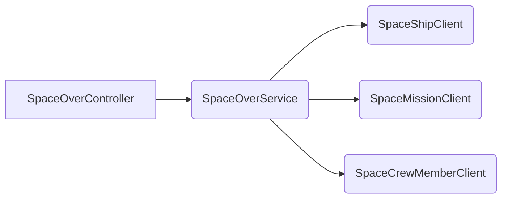

# spacecrew-manager
[](https://github.com/cf-training-springboot-2019/y/blob/master/LICENSE)

A small Spring microservice aimed to expose a web portal that manages all Spaceover platform related entities.
The application uses Spring Boot parent bom version 2.4.5 as its foundation.

## Terminology
| Name | Description |
|:----------:|:-------------|
| SpaceShip | An external managed entity that retains various information associated with a space ship member. |
| SpaceMission | An external managed entity that retains various information associated with a space mission. |
| SpaceCrewMember | An external managed entity that retains various information associated with a space crew member. |


## Operations
| Name | Description |
|:----------:|:-------------|
| getSpaceShips | Synchronous operation that allows the retrieval of multiples persisted space ship member resource entries. |
| getSpaceMissions | Synchronous operation that allows the retrieval of multiples persisted space mission resource entries. |
| getSpaceCrewMembers | Synchronous operation that allows the retrieval of multiples persisted space crew member resource entries. |

## Getting Started

To quickly run the application simply execute spring-boot mvn plugin's **run** goal. This action most be performed from the project's root directory by using the following command in a terminal of your choosing.
```
mvn spring-boot:run
```

An alternative method would be through the creation of an OCI image by executing the plugin's build-image goal.
This image can then be used to run a standalone docker container by using the following command sequence
```
mvn spring-boot:build-image
docker run -d --name [container-name] -p 8080:8080 ${docker.registry}/${project.artifactId}:v${project.version}
```

## Structure
Here are the services beans and relationship:


